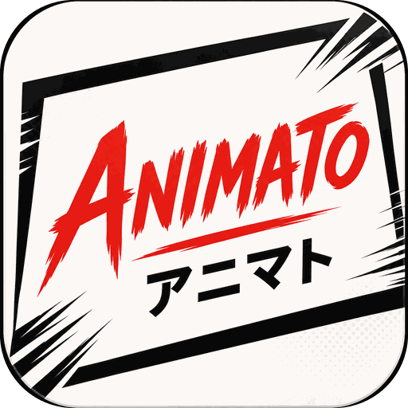
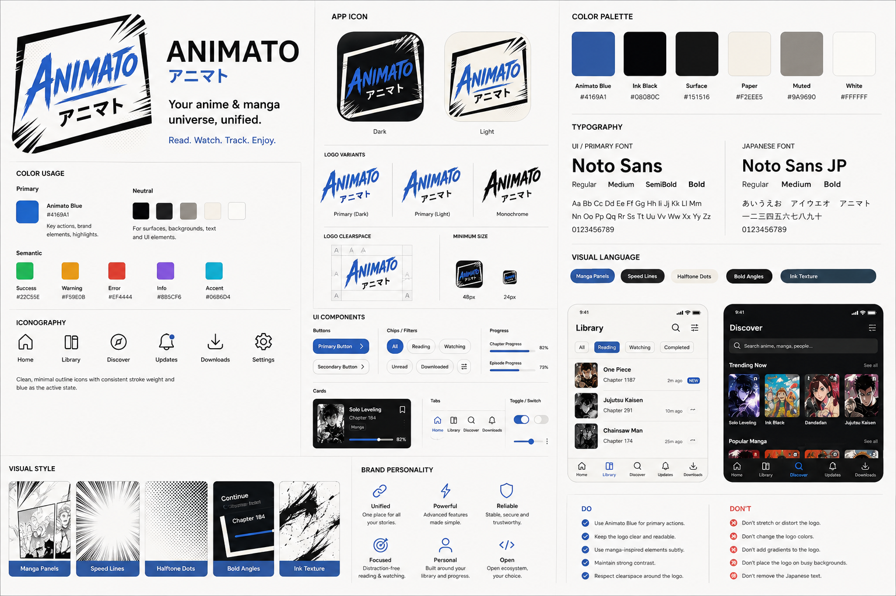

<div align="center">



# Animato

### Your anime & manga universe, unified.

One app, one library, both kinds of story.

[](/LICENSE)


</div>

---

> **Not released yet.** There is no stable build, and the database schema is not frozen.
> Animato does **not** upgrade in place over an existing Aniyomi install — bring your library
> across with a backup import. See
> [ARCHITECTURE.md](ARCHITECTURE.md#why-users-must-not-upgrade-in-place-from-aniyomi).

## What it is

A reader and a player in one place. Animato keeps anime and manga in a single library, with one
set of categories, one search, one download queue and one place to pick up where you left off —
instead of asking you to decide which app you are in before you have decided what you want to
watch or read.

Content comes from extensions you install and configure yourself. Animato ships none of it.

## What it does

- **One library.** Series and shows in the same grid, filtered and sorted together, or apart when
  you want them apart.
- **One-tap continuation.** The first screen is the next chapter and the next episode, whichever
  you touched last.
- **Search across sources.** Search once and see what every installed source has, without knowing
  in advance which one carries it.
- **Downloads that stay readable.** The queue groups by title and range rather than listing every
  chapter, so a hundred queued items still fits on a screen.
- **Tracking inside the title.** AniList, MyAnimeList, Kitsu, Shikimori and Bangumi for both
  halves; Simkl and Jellyfin for anime. Where you are already looking, not on another screen.
- **A reader and a player built for the content.** Chrome that disappears when it is not wanted;
  gestures, playback speed, subtitles and external-player handoff on the anime side.
- **Backups that other apps can read.** One file holds both libraries, written in Aniyomi's format —
  so Aniyomi can open it in full and Mihon can open the manga in it. Aniyomi and Mihon backups import
  the same way, and a restore names anything whose extension is missing before it starts.

Not all of that is wired up yet — this is a pre-release, and
[ARCHITECTURE.md](ARCHITECTURE.md) tracks what is built and what is not.

## Sources

Animato takes content from two different kinds of place, and the difference is worth knowing.

**Extensions** are small Android packages, one per site, installed from a repository. Sources &
extensions holds the repositories and the list. This is the model Mihon and Aniyomi use, and it is
where the manga comes from.

**Stremio addons** are the other shape: a web address that answers JSON. Nothing is installed and
nothing runs inside the app, so an addon cannot crash it or read its storage — the app only ever
talks to it. Sources → **Stremio addons** takes an address; the screen suggests four worth starting
with, and any other addon's `manifest.json` link works the same way.

Addons split the job between them and meet on a shared id, so a working setup is usually more than
one:

| | Provides |
| --- | --- |
| **Anime Kitsu** | An anime catalogue |
| **Cinemeta** | Films and series, with posters and descriptions |
| **Torrentio** | Video |
| **OpenSubtitles v3** | Subtitles, for anything with an IMDb id |

A catalogue addon has no video and a stream addon has no idea what anything is called; installing
one of each is what makes a title playable. Addons that only supply streams or subtitles never
appear as sources — they work behind the ones that do.

### Configuring Torrentio

Torrentio's plain address works, but its useful form is configured first, and the configuration
travels **inside the address** rather than in a settings screen. So it is set up on its own page and
pasted in afterwards:

1. Open <https://torrentio.strem.fun/configure> in a browser.
2. Pick your providers. For anime, add **Nyaa.si**, **AniDex** and **TokyoTosho**.
3. Sort by quality, and filter out `CAM`, `SCR` and `480p` unless you want them.
4. Copy the install link rather than pressing Install — Install tries to hand the address to the
   Stremio app, which is not what you are using it for. The link looks like
   `https://torrentio.strem.fun/providers=…|sort=…/manifest.json`, and the settings you chose are
   that middle segment.
5. Paste it into Sources → Stremio addons.

Torrentio serves torrents, so playback goes through the bundled torrent server. It is on by default
and shows a one-time notice before the first torrent explaining that peer-to-peer sharing uploads as
well as downloads; it can be turned off under Settings → Player → Torrent, and it shuts down when
the player closes.

## Design



Palette, typography, component rules and a screen-by-screen specification live in
[docs/BRANDING.md](docs/BRANDING.md).

## Building

```
./gradlew :animato-app:assembleRelease
```

Requires the Android SDK with API 37 and NDK `29.0.14206865`. Minimum supported device is
Android 8.0 (API 26).

## Documentation

| | |
| --- | --- |
| [ARCHITECTURE.md](ARCHITECTURE.md) | how the app is put together, and what is built so far |
| [ROADMAP.md](ROADMAP.md) | what is worth building next, and why — with the evidence |
| [docs/BRANDING.md](docs/BRANDING.md) | brand and interface specification |
| [UPSTREAM_DIVERGENCE.md](UPSTREAM_DIVERGENCE.md) | where Animato differs from the code it builds on |

## Credit

Animato is built on the work of others, and depends on that work continuing:

- **[Mihon](https://github.com/mihonapp/mihon)** — the manga app Animato is built on. Apache-2.0.
- **[Aniyomi](https://github.com/aniyomiorg/aniyomi)** — the origin of the anime half. Apache-2.0.
- **[Tachiyomi](https://github.com/tachiyomiorg)** — where both began.

Animato is an independent project. It is not affiliated with, endorsed by, or supported by the
Mihon or Aniyomi teams, and problems with it should not be reported to them.

## Disclaimer

Animato hosts zero content. It reads and plays what the user's own configured sources provide, and
the developers have no affiliation with those sources.

## License

<pre>
Copyright © 2015 Javier Tomás
Copyright © 2024 Mihon Open Source Project
Copyright © 2025 Animato Open Source Project

Licensed under the Apache License, Version 2.0 (the "License");
you may not use this file except in compliance with the License.
You may obtain a copy of the License at

http://www.apache.org/licenses/LICENSE-2.0

Unless required by applicable law or agreed to in writing, software
distributed under the License is distributed on an "AS IS" BASIS,
WITHOUT WARRANTIES OR CONDITIONS OF ANY KIND, either express or implied.
See the License for the specific language governing permissions and
limitations under the License.
</pre>
