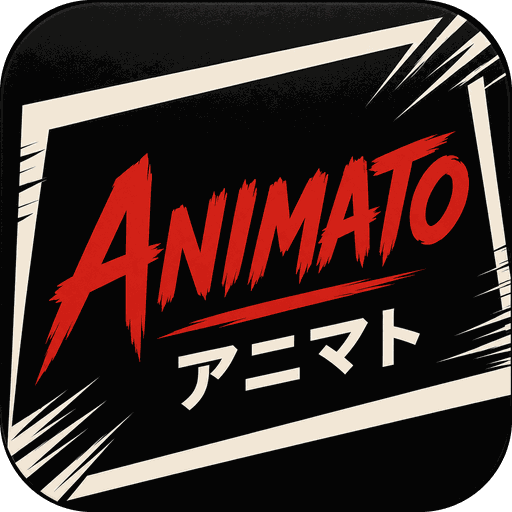

<div align="center">



# Animato

### Your anime & manga universe, unified.

One library for both. Built **on top of** [Mihon](https://github.com/mihonapp/mihon) rather than
forked from it, so every upstream release is a merge instead of a rewrite.

[](/LICENSE)


</div>

---

> **Not released yet.** There is no installable build, and the database schema is not frozen.
> Animato does **not** upgrade in place over an existing Aniyomi install — migration is by backup
> import. See [ARCHITECTURE.md](ARCHITECTURE.md#why-users-must-not-upgrade-in-place-from-aniyomi).

## What it is

Mihon reads manga. Aniyomi added anime to it, and then went two years without an upstream sync,
because a fork that edits 248 upstream files cannot merge one.

Animato takes the anime half and rebuilds it as modules **beside** Mihon instead of inside it.
Mihon's `:app` is consumed as an Android library; our application module supplies the identity, the
theme and the anime side, and never opens a Mihon file.

The measurement that drives the whole design — merging the same upstream into the same repository:

| Branch | Descends from | Conflicting files |
| --- | --- | --- |
| Aniyomi-descended | Aniyomi, forked Jan 2024 | **776** |
| this one | Mihon `77e88a21` | **2** |

Upstream breakage arrives as compile errors in files we own — a short, specific list — rather than
as a merge conflict in files we do not.

## Design


Palette, typography, component rules and a screen-by-screen specification live in
[docs/BRANDING.md](docs/BRANDING.md).

## Building

```
./gradlew :animato-app:assembleRelease
```

Requires the Android SDK with API 37 and NDK `29.0.14206865`. Minimum supported device is
Android 8.0 (API 26).

## Documentation

| | |
| --- | --- |
| [ARCHITECTURE.md](ARCHITECTURE.md) | the layering, the rule about never editing Mihon, migration phases |
| [docs/BRANDING.md](docs/BRANDING.md) | brand and interface specification |
| [UPSTREAM_DIVERGENCE.md](UPSTREAM_DIVERGENCE.md) | what Mihon changed under us, and whether to adopt it |

## Credit

Animato is built on the work of others, and depends on that work continuing:

- **[Mihon](https://github.com/mihonapp/mihon)** — the manga app this is built on, and the upstream
  it tracks. Apache-2.0.
- **[Aniyomi](https://github.com/aniyomiorg/aniyomi)** — the origin of the anime half. Apache-2.0.
- **[Tachiyomi](https://github.com/tachiyomiorg)** — where both began.

Animato is an independent project. It is not affiliated with, endorsed by, or supported by the
Mihon or Aniyomi teams, and problems with it should not be reported to them.

## Disclaimer

Animato hosts zero content. It reads and plays what the user's own configured sources provide, and
the developers have no affiliation with those sources.

## License

<pre>
Copyright © 2015 Javier Tomás
Copyright © 2024 Mihon Open Source Project
Copyright © 2025 Animato Open Source Project

Licensed under the Apache License, Version 2.0 (the "License");
you may not use this file except in compliance with the License.
You may obtain a copy of the License at

http://www.apache.org/licenses/LICENSE-2.0

Unless required by applicable law or agreed to in writing, software
distributed under the License is distributed on an "AS IS" BASIS,
WITHOUT WARRANTIES OR CONDITIONS OF ANY KIND, either express or implied.
See the License for the specific language governing permissions and
limitations under the License.
</pre>
