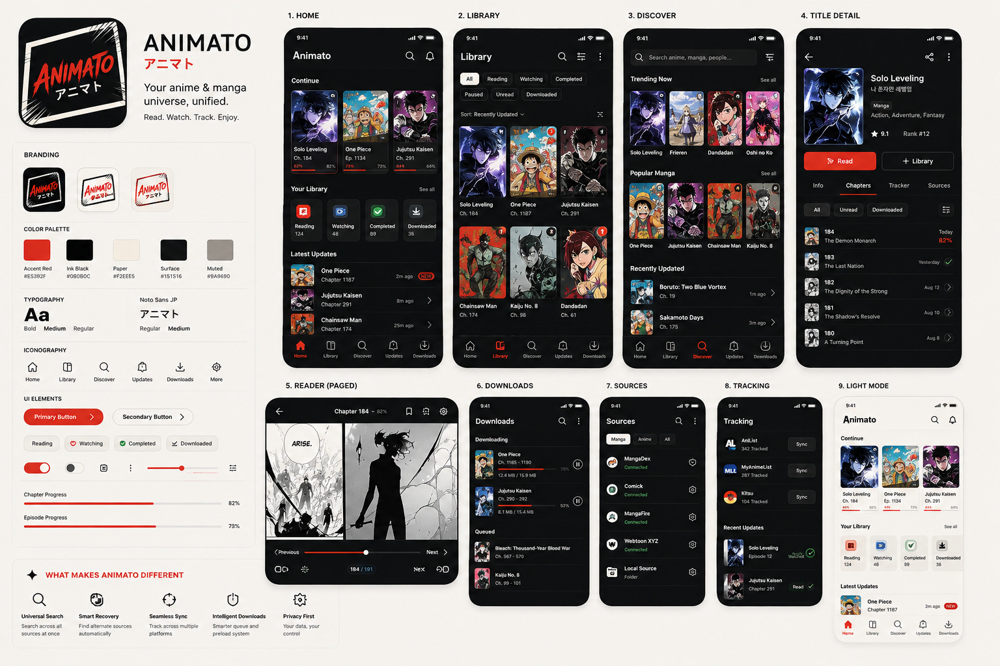

# Animato — brand and interface specification

The reference for anything visual. The palette, type and component rules come from the brand sheet;
the screen-by-screen section is read off the nine mockups in that same sheet and is what the UI
work in phase 6 builds against.



---

## 1. Identity

| | |
| --- | --- |
| Name | Animato |
| Japanese | アニマト |
| Tagline | *Your anime & manga universe, unified.* |
| Secondary | Read. Watch. Track. Enjoy. |
| Keywords | Modern · Manga-inspired · Unified · Fast · Powerful · Clean · Open · Personal · Dynamic · Premium |

**One line:** Animato is a modern anime and manga platform that takes the power and flexibility of
Mihon/Aniyomi and turns it into a unified, polished, source-agnostic media experience.

The visual metaphor is a **manga panel with motion lines** — not anime characters. The logo is
`ANIMATO` in brush/ink lettering with `アニマト` set beneath it in clean Japanese type, inside an
asymmetric, skewed panel frame with selective speed lines.

Two variants: red wordmark on ink black (default) and red wordmark with a black frame on warm
ivory (light).

---

## 2. Colour

| Token | Hex | Use |
| --- | --- | --- |
| Animato Blue | `#4169A1` | Primary actions, progress, active states |
| Ink Black | `#08080C` | Dark background, light-mode typography |
| Surface | `#151516` | Cards and elevated surfaces |
| Paper | `#F2EEE5` | Light background — warm manga paper, never pure white |
| Muted | `#9A9690` | Secondary text |
| White | `#FFFFFF` | Light surfaces |

**The accent is not the interface.** The UI stays largely monochrome so that the accent keeps
meaning: it marks the primary action, the active tab, and progress. A screen with blue in four
places has diluted all four.

### Why blue, and what it cost

The accent was `#E5392F` red until the brand moved to blue. Red reads as energetic and aggressive,
which suits action manga and does not suit an app someone reads in for two hours; blue is calmer to
sit with, and it keeps a thread back to Tachiyomi and Mihon without looking like a clone of either.

It also measures better where it matters most. White on the accent — every filled button, every
primary action — goes from **4.24:1 to 5.59:1**, clearing the 4.5:1 that button labels need, which
the red did not.

The trade runs the other way: the accent drawn *as text* on the ink background is **3.58:1**, where
the red was 4.72:1. That clears AA for large text and UI components, which is what the accent is
used for — tab labels, icons, progress bars — and no single colour clears 4.5:1 in both directions
at once. Given the choice, be good at the button.

One knock-on: the error colour was orange while the accent was red, to keep "do this" and "something
is wrong" from looking alike. With a blue accent there is no clash, so errors are a conventional red
again — which users read without being taught.

**In the logo, blue is a signature, not a wash.** The wordmark is blue; the Japanese type, the panel
frame and the speed lines stay ink or ivory. Blue on everything would make it loud, which is the
opposite of the point.

These values live in `animato-ui-kit/.../AnimatoPalette.kt` as the six inputs a whole Material
scheme is derived from, and in `animato-app/src/main/res/values/animato_brand.xml` for the launcher
icon and splash window, which the platform draws before any Compose code runs. Changing the brand
means editing those six values.

Light mode uses warm paper rather than white — the manga-paper reference is the point.

---

## 3. Typography

| Role | Family | Weights |
| --- | --- | --- |
| UI | Noto Sans | Regular / Medium / Bold |
| Japanese | Noto Sans JP | Regular / Medium |
| Logo | brush/ink lettering | — asset only, never a UI font |

The logo treatment is artwork. Do not attempt to reproduce it with a font.

---

## 4. Iconography

Minimal outline icons, rounded geometric construction, one consistent stroke weight. Red is for
active and selected states only.

Core set: Home · Library · Discover · Updates · Downloads · Search · Filter · Tracker · Sources ·
Settings · More.

No illustrated anime characters, no eyes or faces, no generic Japanese symbols.

---

## 5. Components

- Rounded cards — rounded, not pill-shaped.
- Primary button: filled red, pill. Secondary: outlined, pill, transparent fill.
- Filters are **chips**: selected is a filled ivory chip with black text; unselected is outlined.
- Progress bars and sliders are Accent Red.
- Borders are thin and low-contrast; shadows are minimal. Elevation comes from `Surface`, not
  from drop shadows.
- Artwork is large and prominent; metadata beside it is compact.
- Generous spacing; strong hierarchy.

### Manga DNA — selectively

Use panel borders, speed lines, halftone texture, ink imperfections, Japanese typography,
asymmetric framing, chapter numbering.

Avoid character mascots, eyes and faces, generic Japanese symbols, busy manga backgrounds,
overuse of red, and otaku cliché generally.

---

## 6. Navigation

Five tabs. Active tab is red icon **and** red label.

```
Home        Library        Discover        Updates        Downloads
```

This is not Mihon's structure, and the difference is the whole shape of the app:

| Mihon | Animato | What moved |
| --- | --- | --- |
| Library | Library | Now unified — anime and manga in one grid |
| Updates | Updates | unchanged in role |
| History | *(folded into Home)* | becomes the **Continue** rail |
| Browse | Discover | search-led rather than source-led |
| More | *(overflow menu)* | settings leave the tab bar |
| — | **Home** | new: continue, library stats, latest updates |
| — | **Downloads** | promoted from a sub-screen of More |

Two consequences worth stating before the work starts: **Home and Downloads are new top-level
destinations we own**, and **settings lose their tab**, reachable from the overflow instead.

---

## 7. The screens

### 1 — Home *(new)*

- App bar: `Animato` wordmark left; search and notifications right.
- **Continue** — horizontal rail of large cards. Cover with a content-type badge top-right, title,
  `Ch. 184` or `Ep. 1134`, and a red progress bar with its percentage.
  This is the one-tap resume, and it mixes both content types in a single rail.
- **Your Library** + *See all* — four stat tiles, each a coloured icon chip over a count:
  Reading · Watching · Completed · Downloaded.
- **Latest Updates** — rows of thumbnail, title, chapter, relative time, a red `NEW` pill, chevron.

### 2 — Library

- App bar: `Library`, then search, filter, overflow.
- Chip row wrapping to two lines: All · Reading · Watching · Completed · Paused · Unread ·
  Downloaded.
- Below it, `Sort: Recently Updated ⌄` on the left and the display-mode toggle on the right.
- Three-column cover grid. Badges sit **on** the cover, top-right (unread count in a red circle,
  and the content-type mark). Title and `Ch. 184` sit **below** the cover, not overlaid.

### 3 — Discover

- The app bar *is* the search field: `Search anime, manga, people…` plus a filter button.
- Sections, each with *See all*: **Trending Now**, **Popular Manga**, **Recently Updated**.
- The first two are four-up horizontal cover rails; the last is a list.
- Discovery is by content, not by source. Sources are a setting, not a browsing step.

### 4 — Title detail

- Back · share · overflow.
- Small cover left; right side carries title, native title, a content-type chip, genres, ★ rating
  and rank.
- Two actions side by side: filled red **Read** / **Watch**, and outlined **+ Library**.
- Tab row with a red underline: **Info · Chapters · Tracker · Sources**.
  `Sources` as a tab is new — it is where source switching and recovery live.
- Chip filters: All · Unread · Downloaded, plus a filter button.
- Item rows: thumbnail, bold number, title, and on the right one of — date, red percentage for
  in-progress, or a green check for finished.

### 5 — Reader (paged)

- Top bar: back, `Chapter 184 ⌄ · 82%`, bookmark, page-mode, settings.
- Bottom: `‹ Previous` — red slider — `Next ›`, and under it a control row with a
  `184 / 191` pill in the centre.
- Chrome is an overlay over the page and disappears when not needed.

### 6 — Downloads

- **Downloading**: cover, title, a *range* (`Ch. 1185 – 1190`), red progress with percentage,
  `12.4 MB / 15.9 MB`, and a pause button.
- **Queued**: cover, title, range.
- Grouped by title with ranges rather than one row per chapter — the queue stays readable at
  hundreds of items.

### 7 — Sources

- Chips: Manga · Anime · All.
- Rows: source icon, name, `Connected` in green, and a settings gear. Local Source is listed with
  a `Folder` subtitle.

### 8 — Tracking *(new as a screen)*

- Per-service rows: AniList, MyAnimeList, Kitsu — each with a tracked count and a `Sync` button.
- **Recent Updates**: cover, title, `Episode 12`, a status pill (`Watched` / `Read`) and a green
  check.
- In Mihon tracking exists only inside a title. Animato gives it a home of its own.

### 9 — Light mode

The same Home on `Paper`, with ink-black type and the same red accents. Tiles keep their colour.
Nothing about the layout changes.

---

## 8. Product principles

These are the claims the interface has to earn:

1. **Content first** — sources and technical complexity stay behind the interface.
2. **One-tap continuation** — resume reading or watching from the first screen.
3. **Universal search** — search across sources without knowing which source has it.
4. **Smart source recovery** — when a source fails, find the title elsewhere automatically.
5. **Unified anime + manga** — one library, not two apps sharing a binary.
6. **Intelligent downloads** — preload and queue from behaviour.
7. **Seamless tracking** — AniList/MAL/Kitsu inside the content experience.
8. **Easy migration** — import Tachiyomi/Mihon/Aniyomi backups with source matching.
9. **Reader first** — controls disappear when they are not wanted.
10. **Power without complexity** — the depth exists; it does not dominate the default.

---

## 9. Assets

| File | What |
| --- | --- |
| `docs/branding/brand-sheet.jpg` | the sheet above, the source of this document |
| `docs/branding/icon-dark.png` | 512px icon, dark variant, transparent corners |
| `docs/branding/icon-light.png` | 512px icon, light variant, transparent corners |

In the app, under `animato-app/src/main/res/`:

| Resource | Role |
| --- | --- |
| `mipmap/ic_launcher.xml` | adaptive icon — **overrides Mihon's by name** |
| `drawable-*/animato_icon_foreground.png` | icon artwork, five densities |
| `drawable-*/animato_icon_monochrome.png` | themed-icon silhouette for Android 13+ |
| `drawable-nodpi/animato_logo.png` | in-app logo, light variant |
| `drawable-night-nodpi/animato_logo.png` | in-app logo, dark variant |
| `values/animato_brand.xml` | palette, and the `splash` colour override |
| `drawable/ic_mihon_splash.xml` | splash icon — **overrides Mihon's by name** |

### Why the launcher icon has no light variant

Android does not theme launcher icons: an app ships one icon and the launcher masks it to whatever
shape the device uses. The dark variant is therefore the launcher icon, and the light variant is
used where the platform does honour the theme — in-app, via `drawable-night`.

The one place the system does recolour the icon is the **monochrome** layer, for themed icons on
Android 13+. That is generated from the light artwork, because a black-on-paper silhouette
converts to an alpha mask cleanly.

### How the icon is built

The foreground square spans the inner 72dp of the 108dp canvas. A 72dp square fully contains the
72dp mask circle, so the entire visible area is artwork under any mask, and the rounding comes from
the launcher rather than being baked into the PNG. The background layer is flat `Ink Black`, which
matches the artwork's own background, so no seam is visible whatever shape is applied.

All of this is done by **overriding resource names**, never by editing a Mihon file — the
application module wins resource merging over its library dependencies. See `ARCHITECTURE.md`.
