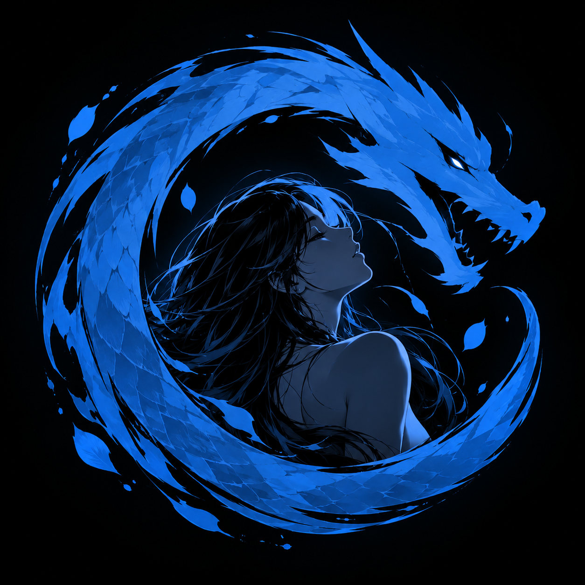
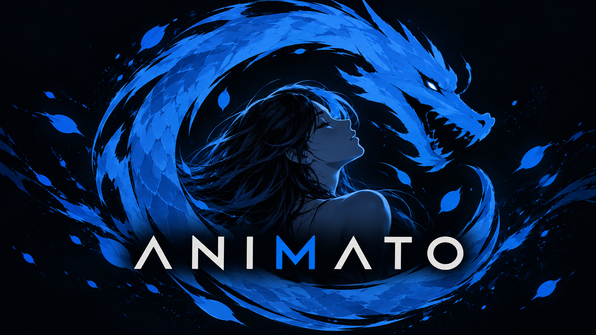

# Animato — brand and interface specification

The reference for anything visual. The palette and the mark are the dragon's, described here; the
screen-by-screen section is read off the nine mockups in `branding/screens.jpg` and is what the UI
work in phase 6 builds against.

 

`branding/brand-sheet.png` is the brand on one page — mark, palette, type and components. This
document is the measured version of it: where the sheet's swatch and a value here differ, the value
here is what ships, and the section that holds it says why.

---

## 1. Identity

| | |
| --- | --- |
| Name | Animato |
| Japanese | アニマト |
| Tagline | *Your anime & manga universe, unified.* |
| Secondary | Read. Watch. Track. Enjoy. |
| Keywords | Modern · Manga-inspired · Unified · Fast · Powerful · Clean · Open · Personal · Dynamic · Premium |

**One line:** Animato is a modern anime and manga platform that takes the power and flexibility of
Mihon/Aniyomi and turns it into a unified, polished, source-agnostic media experience.

The mark is a **blue dragon coiled around a figure looking up**, on black: one ring of colour that
still reads as a ring at 48 pixels, where the detail inside it does not have to. The name, where it
appears, is `ANIMATO` in wide geometric capitals with the **M** in the brand blue — on the TV
banner and in Home's header.

The mark comes on ink black and on white, and the **light version is the default icon**: the
launcher icon and the TV banner are the mark on white. The dark versions draw the launch screen,
which stays ink black, and are kept for documents and promotion on a dark page. `アニマト` was part of the previous mark and is not part of
this one.

---

## 2. Colour

| Token | Hex | Use |
| --- | --- | --- |
| Animato Blue | `#0066F0` | Primary actions, progress, active states |
| Ink Black | `#08080C` | Dark background, light-mode typography |
| Surface | `#151516` | Cards and elevated surfaces |
| Paper | `#F7F9FF` | Light background — a cool off-white, never pure white |
| Muted | `#94A3B8` | Secondary text |
| White | `#FFFFFF` | Light surfaces |

Two more live in the mark and nowhere in the interface — listed so that artwork made for the brand
matches it, not so that a screen uses them:

| Token | Hex | Where |
| --- | --- | --- |
| Dragon Glow | `#0078FC` | The lit edge of the scales. Too light for white text (4.12:1) |
| Abyss | `#011135` | The deepest shadow in the mark, between scale and black |

Semantic colours, which say what happened rather than what to do:

| Token | Hex | Use |
| --- | --- | --- |
| Success | `#22C55E` | Connected, synced, finished |
| Warning | `#F59E0B` | Needs attention, not yet broken |
| Error | `#EF4444` | Failed, destructive |
| Info | `#8B5CF6` | Neutral notice |
| Accent | `#06B6D4` | A second highlight, where blue is already spoken for |

**The accent is not the interface.** The UI stays largely monochrome so that the accent keeps
meaning: it marks the primary action, the active tab, and progress. A screen with blue in four
places has diluted all four.

### Where the blue comes from, and what it measures

**Measured, not picked.** `#0066F0` is the commonest saturated blue in `branding/logo.png` — the
dragon's own colour. It replaced `#4169A1`, a muted steel blue chosen for the previous mark, because
an icon in electric blue opening onto an app in grey-blue reads as two different products.

Against the colour it replaced:

| | `#4169A1` | `#0066F0` | Needs |
| --- | --- | --- | --- |
| White on the accent — every filled button | 5.59:1 | **5.05:1** | 4.5:1 |
| Accent as text or icon on ink | 3.58:1 | **3.96:1** | 3:1 for UI and large text |
| Accent as text on paper | — | **4.36:1** | 3:1 for UI and large text |

It is better where the accent is most often *read* — tab labels, icons, progress on the dark ground
— and slightly worse on buttons, where it still clears the line. Nothing brighter from the mark
keeps the button: Dragon Glow is 4.12:1 for white text. No single colour clears 4.5:1 in both
directions; be good at the button.

The red that preceded both (`#E5392F`) is why errors were orange for a while. With a blue accent
there is no clash, so errors are a conventional red — which users read without being taught.
`#EF4444` is 5.31:1 on ink but only 3.25:1 on paper, so in light mode the theme darkens it toward the
text colour rather than drawing the brand value at body-text size.

**In the mark, blue is the whole colour; in the interface, it is a signature.** The dragon is blue
on black and nothing else, which is what makes it readable at icon size. The app does the opposite —
mostly monochrome, with blue where it means something — and the wordmark sits between the two: white,
with one blue letter.

These values live in `animato-ui-kit/.../AnimatoPalette.kt` as the six inputs a whole Material
scheme is derived from, and in `animato-app/src/main/res/values/animato_brand.xml` for the launcher
icon and splash window, which the platform draws before any Compose code runs. Changing the brand
means editing those values in both.

Light mode uses a cool off-white rather than white, and the muted grey is a slate to match it. Both
come from the brand sheet; the warm cream they replaced belonged to the previous, red mark, and beside
electric blue it looked aged rather than deliberate.

The sheet's blue swatch samples a shade lighter than `#0066F0`. The darker value stays: white on the
sheet's swatch falls just under the 4.5:1 a button label needs, and every filled button is white on
blue.

---

## 3. Typography

| Role | Family | Weights |
| --- | --- | --- |
| UI | Noto Sans | Regular / Medium / Bold |
| Japanese | Noto Sans JP | Regular / Medium |
| Logo | brush/ink lettering | — asset only, never a UI font |

The logo treatment is artwork. Do not attempt to reproduce it with a font.

---

## 4. Iconography

Minimal outline icons, rounded geometric construction, one consistent stroke weight. Red is for
active and selected states only.

Core set: Home · Library · Discover · Updates · Downloads · Search · Filter · Tracker · Sources ·
Settings · More.

No illustrated anime characters, no eyes or faces, no generic Japanese symbols.

---

## 5. Components

- Rounded cards — rounded, not pill-shaped.
- Primary button: filled red, pill. Secondary: outlined, pill, transparent fill.
- Filters are **chips**: selected is a filled ivory chip with black text; unselected is outlined.
- Progress bars and sliders are Accent Red.
- Borders are thin and low-contrast; shadows are minimal. Elevation comes from `Surface`, not
  from drop shadows.
- Artwork is large and prominent; metadata beside it is compact.
- Generous spacing; strong hierarchy.

### Manga DNA — selectively

Use panel borders, speed lines, halftone texture, ink imperfections, Japanese typography,
asymmetric framing, chapter numbering.

Avoid character mascots, eyes and faces, generic Japanese symbols, busy manga backgrounds,
overuse of red, and otaku cliché generally.

---

## 6. Navigation

Five tabs. Active tab is red icon **and** red label.

```
Home        Library        Discover        Updates        Downloads
```

This is not Mihon's structure, and the difference is the whole shape of the app:

| Mihon | Animato | What moved |
| --- | --- | --- |
| Library | Library | Now unified — anime and manga in one grid |
| Updates | Updates | unchanged in role |
| History | *(folded into Home)* | becomes the **Continue** rail |
| Browse | Discover | search-led rather than source-led |
| More | *(overflow menu)* | settings leave the tab bar |
| — | **Home** | new: continue, library stats, latest updates |
| — | **Downloads** | promoted from a sub-screen of More |

Two consequences worth stating before the work starts: **Home and Downloads are new top-level
destinations we own**, and **settings lose their tab**, reachable from the overflow instead.

---

## 7. The screens

### 1 — Home *(new)*

- App bar: `Animato` wordmark left; search and notifications right.
- **Continue** — horizontal rail of large cards. Cover with a content-type badge top-right, title,
  `Ch. 184` or `Ep. 1134`, and a red progress bar with its percentage.
  This is the one-tap resume, and it mixes both content types in a single rail.
- **Your Library** + *See all* — four stat tiles, each a coloured icon chip over a count:
  Reading · Watching · Completed · Downloaded.
- **Latest Updates** — rows of thumbnail, title, chapter, relative time, a red `NEW` pill, chevron.

### 2 — Library

- App bar: `Library`, then search, filter, overflow.
- Chip row wrapping to two lines: All · Reading · Watching · Completed · Paused · Unread ·
  Downloaded.
- Below it, `Sort: Recently Updated ⌄` on the left and the display-mode toggle on the right.
- Three-column cover grid. Badges sit **on** the cover, top-right (unread count in a red circle,
  and the content-type mark). Title and `Ch. 184` sit **below** the cover, not overlaid.

### 3 — Discover

- The app bar *is* the search field: `Search anime, manga, people…` plus a filter button.
- Sections, each with *See all*: **Trending Now**, **Popular Manga**, **Recently Updated**.
- The first two are four-up horizontal cover rails; the last is a list.
- Discovery is by content, not by source. Sources are a setting, not a browsing step.

### 4 — Title detail

- Back · share · overflow.
- Small cover left; right side carries title, native title, a content-type chip, genres, ★ rating
  and rank.
- Two actions side by side: filled red **Read** / **Watch**, and outlined **+ Library**.
- Tab row with a red underline: **Info · Chapters · Tracker · Sources**.
  `Sources` as a tab is new — it is where source switching and recovery live.
- Chip filters: All · Unread · Downloaded, plus a filter button.
- Item rows: thumbnail, bold number, title, and on the right one of — date, red percentage for
  in-progress, or a green check for finished.

### 5 — Reader (paged)

- Top bar: back, `Chapter 184 ⌄ · 82%`, bookmark, page-mode, settings.
- Bottom: `‹ Previous` — red slider — `Next ›`, and under it a control row with a
  `184 / 191` pill in the centre.
- Chrome is an overlay over the page and disappears when not needed.

### 6 — Downloads

- **Downloading**: cover, title, a *range* (`Ch. 1185 – 1190`), red progress with percentage,
  `12.4 MB / 15.9 MB`, and a pause button.
- **Queued**: cover, title, range.
- Grouped by title with ranges rather than one row per chapter — the queue stays readable at
  hundreds of items.

### 7 — Sources

- Chips: Manga · Anime · All.
- Rows: source icon, name, `Connected` in green, and a settings gear. Local Source is listed with
  a `Folder` subtitle.

### 8 — Tracking *(new as a screen)*

- Per-service rows: AniList, MyAnimeList, Kitsu — each with a tracked count and a `Sync` button.
- **Recent Updates**: cover, title, `Episode 12`, a status pill (`Watched` / `Read`) and a green
  check.
- In Mihon tracking exists only inside a title. Animato gives it a home of its own.

### 9 — Light mode

The same Home on `Paper`, with ink-black type and the same red accents. Tiles keep their colour.
Nothing about the layout changes.

---

## 8. Product principles

These are the claims the interface has to earn:

1. **Content first** — sources and technical complexity stay behind the interface.
2. **One-tap continuation** — resume reading or watching from the first screen.
3. **Universal search** — search across sources without knowing which source has it.
4. **Smart source recovery** — when a source fails, find the title elsewhere automatically.
5. **Unified anime + manga** — one library, not two apps sharing a binary.
6. **Intelligent downloads** — preload and queue from behaviour.
7. **Seamless tracking** — AniList/MAL/Kitsu inside the content experience.
8. **Easy migration** — import Tachiyomi/Mihon/Aniyomi backups with source matching.
9. **Reader first** — controls disappear when they are not wanted.
10. **Power without complexity** — the depth exists; it does not dominate the default.

---

## 9. Assets

Sources, kept full size under `docs/branding/`:

| File | What |
| --- | --- |
| `logo.png` | 1254×1254, the mark on transparency — **the source of the launch screen and the icon's monochrome layer** |
| `logo-on-dark.png` | the same mark on black, for documents and anywhere a flat image is wanted |
| `logo-on-light.png` | the mark on white — **the source of the launcher icon** |
| `tv-banner.png` | 1672×941, 16:9, the mark with the name on dark, for promotion |
| `tv-banner-light.png` | the same banner on white — **the source of the TV banner** |
| `wordmark-on-light.png`, `wordmark-on-dark.png` | the name alone on transparency — ink letters and white letters, blue M in both |
| `brand-sheet.png` | the brand on one page: mark, palette, type, components |
| `splash-pulse-reference.gif` | the launch-screen animation as designed; the app rebuilds it rather than playing it |
| `build-icon.py` | launcher foreground and monochrome layers, five densities each |
| `build-splash.py` | the launch-screen mark and its breathing frames |
| `build-tv-banner.py` | the 320×180 banner |
| `build-wordmark.py` | the header wordmark, both colourways, five densities each |
| `icon-light.png`, `icon-dark.png` | the previous brand, kept for reference |

In the app, under `animato-app/src/main/res/`:

| Resource | Role |
| --- | --- |
| `mipmap/ic_launcher.xml` | adaptive icon — **overrides Mihon's by name** |
| `drawable-*/animato_icon_foreground.png` | the mark, five densities |
| `drawable-*/animato_icon_monochrome.png` | themed-icon silhouette for Android 13+ |
| `drawable-*/animato_wordmark_on_light.png`, `animato_wordmark_on_dark.png` | the header wordmark; `AnimatoWordmark` picks by the bar's surface, not the system night flag |
| `drawable-xhdpi/animato_tv_banner.png` | the TV home-screen banner |
| `drawable/ic_mihon_splash.xml` | launch icon below Android 12, static — **overrides Mihon's by name** |
| `drawable-v31/ic_mihon_splash.xml` | launch icon from Android 12, the breathing `animation-list` |
| `drawable-nodpi/animato_splash_mark.png`, `animato_splash_pulse_*.png` | its frames |
| `values/animato_brand.xml` | palette, and the `splash` colour override |

### One launcher icon, on white

Android does not theme launcher icons: an app ships one and the launcher masks it to whatever shape
the device uses. The icon is the light mark, so the adaptive icon's background layer is flat white
(`@color/animato_icon_background`) and the foreground is the mark with its white ground taken out —
colour to alpha, which over a white background gives back every pixel exactly. A launcher may slide
the two layers against each other for parallax, which is why the foreground carries no background
of its own.

The one place the system recolours the icon is the **monochrome** layer, for themed icons on
Android 13+.

### How the icon is built

```
python3 docs/branding/build-icon.py
```

**The mark is scaled until its ring fits the 66dp circle**, measured on the artwork's own opaque
pixels rather than on the file's edges. 66dp of the 108dp canvas is what every launcher is
guaranteed to show; draw it any larger and the circular mask half of all launchers apply takes the
dragon's head off — the part the mark is recognised by.

**The monochrome layer is a brightness mask, not an alpha mask.** The figure in the middle is
opaque, so the source's alpha alone fills the ring and the figure in to one disc and the dragon
disappears. The dragon is light blue and the figure near black, so keeping only what is both opaque
and bright keeps the ring and the head — the right silhouette, generated rather than drawn by hand.

### The launch screen

```
python3 docs/branding/build-splash.py
```

The mark breathes — it dims to 46% and comes back on a 1.92 s loop, both numbers measured off the
reference GIF. Android's launch screen cannot play a GIF, so from Android 12 it is an
`animation-list` rebuilt from `logo.png`, which also avoids the GIF's 256-colour banding in the
scales. Seven brightness levels at 640px, walked down and back up: every frame is decoded up front at
the moment an app has the least memory to spare, and a frame named twice is decoded once. Below
Android 12 the launch screen is static.

All of this is done by **overriding resource names**, never by editing a Mihon file — the
application module wins resource merging over its library dependencies. See `ARCHITECTURE.md`.

---

## 10. Asset sizes, for when the artwork changes

Everything below is measured from the files in the tree, not from what a script intends. A rebrand
replaces the source artwork and re-runs the scripts; this table is what to hand a designer so the
output lands without a second round.

### What to supply

| Give us | Size | Notes |
| --- | --- | --- |
| `docs/branding/logo-on-light.png` | **square, 1024px or more**, on white | The mark alone, drawn for white. The launcher icon is built from it |
| `docs/branding/logo.png` | **square, 1024px or more**, transparent | The mark alone, drawn for black. The launch screen and the icon's monochrome layer are built from it |
| `docs/branding/tv-banner-light.png` | **16:9, 1280×720 or more**, opaque | Must carry the name — a TV launcher does not label banners. Keep the edges quiet: TV home screens draw a focus border tight against them |
| `docs/branding/wordmark-on-light.png`, `wordmark-on-dark.png` | **wide, 200px tall letters or more**, transparent | The name alone, once in ink and once in white. Two files, not one tinted: the M is blue in both, and a tint would paint it over |

### What gets generated

| Asset | Size | Where | Built by |
| --- | --- | --- | --- |
| Launcher foreground | 108 / 162 / 216 / 324 / 432 px square | `drawable-{m,h,xh,xxh,xxx}dpi/animato_icon_foreground.png` | `build-icon.py` |
| Launcher monochrome | the same five sizes | `…/animato_icon_monochrome.png` | `build-icon.py` |
| Launch mark and frames | 640px square | `drawable-nodpi/animato_splash_*.png`, `drawable-v31/ic_mihon_splash.xml` | `build-splash.py` |
| TV banner | **320×180**, RGB, opaque | `drawable-xhdpi/animato_tv_banner.png` | `build-tv-banner.py` |
| Header wordmark | 24dp tall at five densities, both colourways | `drawable-*/animato_wordmark_on_{light,dark}.png` | `build-wordmark.py` |

```
python3 docs/branding/build-icon.py
python3 docs/branding/build-splash.py
python3 docs/branding/build-tv-banner.py
python3 docs/branding/build-wordmark.py
```

### The rules the numbers come from

- **The launcher canvas is 108dp and the mark spans its inner 66dp.** That is the circle every
  launcher shows whatever mask it applies.
- **The five densities are 1×, 1.5×, 2×, 3× and 4× of 108.** Nothing chooses them; they are what
  Android asks for.
- **A launch icon with no background is a 288dp canvas masked to a 192dp circle**, so the launch
  mark spans two thirds of its frame — the same rule, for the same reason.
- **The banner is one fixed 320×180 tile, opaque, with no density variants.** A TV launcher scales
  a single image rather than picking per density. The script scales the supplied artwork and
  refuses anything that is not 16:9, rather than cropping it quietly.

### Assets a rebrand also touches, and no script builds

| Asset | Where |
| --- | --- |
| Launch window colour | `@color/splash`, and **its `night` variant too**; overriding one configuration leaves the other on Mihon's |
| The accent | `AnimatoPalette.kt` **and** `animato_brand.xml` — the second is what the platform draws before Compose runs |

### Two failure modes worth remembering

- **A monochrome layer is not a greyscale copy.** Android draws it as a single-colour mask, so
  anything relying on a colour difference to be legible disappears. Built from opacity alone, this
  mark's layer was a disc; it is built from brightness for that reason.
- **A resource override replaces one configuration at a time.** Check the built APK with
  `aapt2 dump resources` rather than assuming: it lists every configuration of a name and shows
  which one won.
